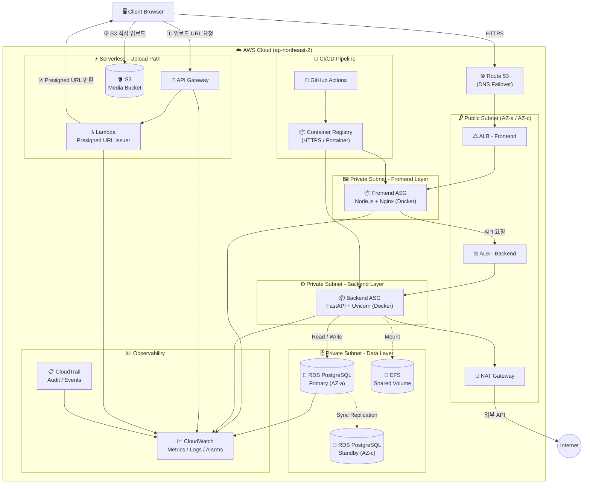

# 커뮤니티 프로젝트 인프라 및 안정성 설계 보고서

**작성자**: Sung-Jin
**작성일**: 2026년 2월 27일
**문서 유형**: 인프라 설계 / 고가용성 아키텍처 보고서
**대상 독자**: 개발팀, 운영팀, 기술 검토자

---

## Executive Summary

본 문서는 개발 중인 커뮤니티 서비스를 **실제 운영 환경**으로 가정하여, 단순 기능 구현이 아닌 **인프라 안정성(Reliability)**, **장애 격리(Fault Containment)**, **고가용성(High Availability)**, **복구 전략(Disaster Recovery)** 중심으로 설계한 기술 보고서입니다.

### 핵심 설계 철학

| 원칙 | 내용 |
| :--- | :--- |
| **SPOF 제거** | 모든 레이어에서 단일 장애 지점(Single Point of Failure)을 구조적으로 제거 |
| **Blast Radius 최소화** | 업로드 경로와 API 경로를 분리하여 장애 전파 반경을 사전 차단 |
| **정량적 복구 기준 수립** | RTO/RPO를 장애 등급별로 수치화하여 운영 대응 기준을 명확히 함 |
| **자동화 우선** | 수동 개입 없이 자동 복구(Self-healing), 자동 확장(Auto Scaling)을 우선 설계 |
| **Security by Design** | 최소 권한 원칙, 네트워크 격리, 암호화를 아키텍처 초기부터 내재화 |
| **비용 효율** | 평시에는 최소 인스턴스로 운영하고 트래픽에 비례하여 탄력적으로 확장 |

---

## 1. 시스템 아키텍처 설계도

### 1.1. 전체 인프라 구성도

AWS 클라우드 환경에서 **다중 가용 영역(Multi-AZ)** 을 기반으로 내결함성을 확보한 계층형 아키텍처입니다. Public/Private Subnet을 엄격히 분리하고, 이미지 업로드 트래픽은 메인 API 서버를 우회하여 S3로 직접 전달됩니다.



### 1.2. 기술 스택 및 서비스 역할 정의

| 구분 | 기술/서비스 | 역할 및 선택 이유 |
| :---: | :--- | :--- |
| **Client** | Web Browser | 사용자 인터페이스. 정적 에셋 로딩 및 동적 API 통신 담당 |
| **Frontend** | Node.js + Express | 화면 렌더링(SSR/CSR), 라우팅, API 프록시 역할 |
| **Reverse Proxy** | Nginx (Docker) | SSL 오프로딩, 정적 파일 캐싱, 압축(gzip), Backend로의 요청 프록시 |
| **Backend** | FastAPI + Uvicorn | Python 비동기 기반 REST API. 인증·게시글·댓글·좋아요 비즈니스 로직 처리 |
| **Database** | Amazon RDS for PostgreSQL | 트랜잭션 기반 영구 데이터 저장. Multi-AZ로 고가용성 보장 |
| **Object Storage** | Amazon S3 | 이미지·미디어 파일 저장. Presigned URL 기반 직접 업로드로 WAS 부하 우회 |
| **Shared Storage** | Amazon EFS | 여러 컨테이너 인스턴스가 공유해야 하는 파일 볼륨 마운트 |
| **Upload API** | API Gateway + Lambda | Presigned URL 발급 전담 Serverless 경로. 메인 API 부하 완전 분리 |
| **DNS** | Route 53 | Latency-based 라우팅 + Health Check 기반 Failover 지원 |
| **Load Balancer** | Application Load Balancer | L7 수준 트래픽 분산. FE/BE 각각 독립 ALB 구성 |
| **CI/CD** | GitHub Actions + Portainer | 코드 변경 → 빌드 → 이미지 푸시 → 무중단 배포 자동화 |
| **Observability** | CloudWatch + CloudTrail | 메트릭 수집, 로그 집계, 운영 경보 및 감사 이력 관리 |
| **IaC** | Terraform | 전체 인프라를 코드로 정의하여 재현 가능한 환경 구성 보장 |

### 1.3. 핵심 데이터 흐름 (Request Flow)

#### 일반 API 요청 흐름
```
Client → Route53 → ALB(Frontend) → Frontend EC2
       → ALB(Backend) → Backend EC2 → RDS PostgreSQL
```

#### 미디어 업로드 흐름 (S3 Direct Upload)
```
① Client → API Gateway → Lambda(Presigned URL 발급)
② Lambda → Presigned URL 반환 → Client
③ Client → S3 직접 PUT 업로드
```
> 업로드 트래픽이 Backend EC2를 거치지 않으므로, 대용량 파일 업로드 시에도 API 서버의 메모리/CPU에 영향이 없습니다.

#### DB 접근 계층 설계
- **SQLAlchemy ORM** + **Connection Pool** (SQLite 개발 / PostgreSQL 운영 환경 분리)
- 실제 DB URL은 환경변수(`DATABASE_URL`)로 주입하여 코드-환경 이중화
- 운영 환경에서 `pool_pre_ping=True` 설정으로 끊긴 연결 자동 폐기 후 재수립

---

## 2. 예상 트래픽 기반 장애 시나리오

### 2.1. 트래픽 증가 상황 가정

커뮤니티 서비스 특성상, **핫이슈·논쟁 게시물 확산** 또는 **외부 바이럴** 상황에서 단기간 내 급격한 트래픽 폭증이 가장 현실적인 위협 시나리오입니다.

| 지표 | 평시 | 피크 시 (이벤트·바이럴) | 증가율 |
| :--- | :---: | :---: | :---: |
| 동시 접속자 수 | 500명 | 3,000명 | **6배** |
| API RPS | ~150 RPS | ~1,500 RPS | **10배** |
| DB Read/Write 비율 | 8 : 2 | 6 : 4 | Write **2배 증가** |
| 미디어 업로드 비중 | 전체 요청의 5% | 전체 요청의 20% | **4배** |
| DB Connection 수 | ~80개 | ~600개 (Pool 고갈 임박) | **7.5배** |

### 2.2. 병목 지점(Bottleneck) 심층 분석

#### 🔴 DB Layer — 가장 심각한 위협

PostgreSQL은 Write 작업 시 Row-level Lock을 사용합니다. 댓글·좋아요가 동시 폭증하면 동일 게시글 Row에 대한 **Write Lock Contention(경합)** 이 발생하고, IOPS가 한계에 도달하면 쿼리 응답 지연이 기하급수적으로 늘어납니다.

- **Connection Pool 고갈**: SQLAlchemy Pool Size 기본값(5~10) 초과 시 새 요청 전부 대기 큐에 적체
- **CPU 100% 도달**: 복잡한 JOIN 쿼리 또는 인덱스 미적용 Full Scan 쿼리가 트래픽 증가와 맞물려 CPU 포화
- **Autovacuum 충돌**: 피크 Write 중 Autovacuum이 동시에 실행되면 Lock 충돌 및 성능 저하 복합 발생
- **view_count 경쟁 조건**: 여러 요청이 동시에 조회수를 갱신할 때 Read→Modify→Write 패턴은 카운트를 유실 → **원자적 `UPDATE ... SET view_count = view_count + 1` 로 해결**

#### 🟠 WAS / Backend Layer — 연쇄 장애의 전파점

- **Uvicorn Worker 포화**: FastAPI는 비동기 처리이지만 DB 응답 대기로 인해 Event Loop가 Blocking 상태에 빠질 수 있음
- **메모리 OOM**: 업로드 파일을 WAS에서 직접 처리하는 구조에서 대용량 파일 다수 동시 처리 시 OOM Killer 발동 → Presigned URL 아키텍처로 원천 차단
- **504 Gateway Timeout**: DB 응답 지연 → Backend 처리 시간 초과 → ALB가 Target을 Unhealthy로 판정

#### 🟡 ALB / Network Layer — 장애 증폭기

- **Unhealthy Target 증가**: Backend EC2 과부하 → `/health` 응답 지연 → ALB가 해당 인스턴스를 Target Group에서 제거 → 잔여 인스턴스로 부하 집중 → 연쇄 Unhealthy 전파
- **NAT Gateway SNAT Port 고갈**: 외부 API 호출 증가로 동일 NAT Gateway의 SNAT 포트(최대 55,000개/IP) 고갈로 외부 통신 실패

### 2.3. 장애 발생 시 영향 범위 및 전파 구조

#### 연쇄 장애 흐름도 (Cascading Failure)


#### 영향 범위 및 아키텍처 격리 효과

| 장애 발생 컴포넌트 | 직접 영향 범위 | 전파 차단 설계 |
| :--- | :--- | :--- |
| RDS Primary 장애 | 인증·게시글·댓글 전체 기능 불가 | Multi-AZ Standby 자동 승격 (60초 내) |
| Backend EC2 장애 | API 응답 불가 | ASG Self-healing + ALB Target 자동 제외 |
| 미디어 업로드 폭증 | 업로드 기능 저하 | **S3 Presigned URL 분리**로 WAS 무영향 |
| 단일 AZ 장애 | 해당 AZ 내 인스턴스 전체 불가 | 잔여 AZ로 ALB 자동 트래픽 전환 |
| NAT Gateway 과부하 | 외부 API 호출 실패 | 외부 연동 기능 일부 저하, 핵심 기능은 내부 통신으로 유지 |

---

## 3. 고가용성(HA) 구현 방안

본 커뮤니티 프로젝트는 **SPOF(Single Point of Failure) 제거**와 **자동화된 자가복구**를 핵심 목표로 AWS 서비스를 조합한 고가용성 아키텍처를 설계하였습니다.

### 3.1. 가용 영역(AZ) 분산 전략

#### Multi-AZ 배치 구조

| 레이어 | AZ-a (ap-northeast-2a) | AZ-c (ap-northeast-2c) |
| :---: | :---: | :---: |
| **Public Subnet** | ALB (FE/BE), NAT GW | ALB (FE/BE), NAT GW |
| **Frontend** | EC2 인스턴스 (FE ASG) | EC2 인스턴스 (FE ASG) |
| **Backend** | EC2 인스턴스 (BE ASG) | EC2 인스턴스 (BE ASG) |
| **Database** | RDS Primary | RDS Standby (자동 페일오버 대상) |

#### 서브넷 보안 격리 원칙

- **Public Subnet**: 외부 인터넷과 직접 통신하는 ALB, NAT Gateway만 배치
- **Private Subnet**: Backend EC2, RDS, EFS는 모두 Private Subnet에 격리. 외부에서 직접 접근 불가 (SG 이중 차단)
- **Security Group 최소 권한 원칙**: ALB → FE (포트 3000만 허용), FE → BE ALB (443만 허용), BE → RDS (포트 5432, BE SG에서만 허용)

### 3.2. Auto Scaling 및 Load Balancer 활용 방안

#### ALB(Application Load Balancer) 계층 분리

Frontend와 Backend 트래픽을 별도 ALB로 분리하여, 병목 지점을 레이어별로 독립적으로 측정·제어할 수 있습니다.

| 구성 | Frontend ALB | Backend ALB |
| :--- | :---: | :---: |
| **리스너** | HTTPS 443 | HTTPS 443 |
| **Health Check** | `GET /health` (200 OK) | `GET /health` + DB ping (503 시 제외) |
| **Idle Timeout** | 60초 | 120초 |
| **Cross-Zone LB** | 활성화 | 활성화 |
| **Access Log** | S3 → CloudWatch | S3 → CloudWatch |

> `/health` 엔드포인트는 단순 200 응답이 아니라 **DB `SELECT 1` ping을 포함**하여, DB 장애 시 503을 반환하도록 구현되었습니다. 이로써 ALB Health Check가 실제 DB 장애를 감지하여 트래픽을 자동 차단합니다.

#### Auto Scaling Group (ASG) 동적 정책

**Backend ASG**

| 항목 | 값 |
| :--- | :--- |
| Minimum Instances | 2 (Multi-AZ 최소 1개씩) |
| Desired Instances | 2 |
| Maximum Instances | 10 |
| Scale-out 조건 | CPU > 60% (5분 지속) **OR** RequestCountPerTarget > 500/분 |
| Scale-in 조건 | CPU < 30% (10분 지속) |
| Cooldown Period | 300초 |
| 배포 방식 | Rolling (최소 1개 유지) + Health-gated Promotion |

**Frontend ASG**

| 항목 | 값 |
| :--- | :--- |
| Minimum Instances | 2 |
| Desired Instances | 2 |
| Maximum Instances | 6 |
| Scale-out 조건 | CPU > 70% (5분 지속) |
| Cooldown Period | 300초 |

### 3.3. 데이터 이중화 및 백업 전략

#### RDS 이중화 구성

- **Multi-AZ Synchronous Replication**: Primary ↔ Standby 간 블록 레벨 동기식 복제. 트랜잭션이 Standby에 기록 완료되어야 Primary에서 Commit 응답 반환 → **데이터 유실 0에 수렴**
- **자동 Failover**: Primary 장애 감지 후 약 60~120초 내 Standby가 Primary로 자동 승격, 연결 문자열(DNS Endpoint) 변경 없이 자동 전환
- **RDS Proxy (선택적 적용)**: Connection Pooling을 DB 앞단에서 RDS Proxy가 담당하여 Failover 시 연결 재수립 지연 최소화

#### 백업 체계

| 대상 | 방식 | 보존 주기 | 복구 가능 범위 |
| :--- | :--- | :---: | :--- |
| **RDS** | 자동 백업 + PITR | 7일 | 최근 7일 중 임의 5분 단위 시점 복원 |
| **RDS** | 수동 스냅샷 | 월별 보존 | 전체 DB 특정 시점 복원 |
| **S3** | Versioning | 삭제 후 90일 | 객체 이전 버전 및 삭제 복구 |
| **S3** | Lifecycle 정책 | 90일 후 Glacier 이관 | 장기 보존 비용 최소화 |
| **EFS** | AWS Backup 일일 백업 | 30일 | 지정 시점 전체 파일 시스템 복원 |

#### S3 데이터 보호

- **Versioning 활성화**: 동일 Key 덮어쓰기 또는 실수로 인한 삭제 시 이전 버전 복원 가능
- **MFA Delete**: 버킷 관리자 계정에 MFA Delete 활성화로 의도치 않은 대량 삭제 방지
- **(선택) Cross-Region Replication**: 서울 리전 전체 장애 시 도쿄 등 타 리전으로 미디어 자산 복구 가능

### 3.4. 장애 복구 전략 (RTO / RPO 관점)

> - **RTO (Recovery Time Objective)**: 장애 발생부터 서비스가 정상 복구될 때까지 허용되는 **최대 시간**
> - **RPO (Recovery Point Objective)**: 장애 발생 시점 기준, 허용 가능한 **최대 데이터 유실 범위**

| 등급 | 장애 시나리오 | 영향 범위 | RTO 목표 | RPO 목표 | 복구 방식 |
| :---: | :--- | :--- | :---: | :---: | :--- |
| **Tier 1** | 단일 EC2 인스턴스 OOM·장애 | 해당 인스턴스 트래픽 일시 불균형 | **3분** | **0** | ALB Health Check 실패 → ASG 자동 교체 → 새 인스턴스 편입 |
| **Tier 2** | 단일 가용 영역(AZ) 장애 | 해당 AZ 내 인스턴스 전체 불가 | **5분** | **0** | Route53 + ALB Cross-Zone 트래픽 자동 전환 |
| **Tier 3** | RDS Primary DB 장애 | DB Read/Write 전체 불가 | **1~2분** | **≈ 0** | Multi-AZ 동기식 복제 → Standby 자동 승격 |
| **Tier 4** | 리전 전체 재해 | 모든 서비스 완전 중단 | **2~4시간** | **최대 1시간** | Cross-Region 스냅샷 복원 + 전체 인프라 재프로비저닝 |
| **Tier 4** | 휴먼 에러 DB 삭제 | 해당 테이블/레코드 소멸 | **30분~2시간** | **최대 5분** | PITR 지정 시각 복원 (오류 쿼리 실행 직전 시점으로 롤백) |

---

## 4. 보안 설계

실제 서비스 운영을 가정하였을 때 보안은 인프라 설계와 동시에 고려되어야 합니다. 본 프로젝트는 **Defense in Depth (심층 방어)** 전략을 적용합니다.

### 4.1. 네트워크 계층 보안

| 계층 | 적용 항목 |
| :--- | :--- |
| **VPC 격리** | 서비스 전용 VPC. Public/Private Subnet 엄격 분리 |
| **Security Group** | 최소 포트 원칙. ALB만 인터넷 허용, EC2·RDS는 SG 연결로만 통신 |
| **NAT Gateway** | Private 인스턴스의 아웃바운드만 허용, 인바운드 진입 차단 |
| **S3 Block Public Access** | 버킷 수준에서 Public Access 전면 차단. Presigned URL로만 접근 |
| **HTTPS 강제** | ALB에서 HTTP → HTTPS 301 리다이렉트, Portainer HTTPS 강제 |

### 4.2. 애플리케이션 계층 보안

| 항목 | 구현 방식 |
| :--- | :--- |
| **인증** | JWT Access Token (15분) + UUID 기반 Refresh Token (14일), Session DB 저장 |
| **비밀번호 보안** | bcrypt 해싱 적용. 대문자/소문자/숫자/특수문자 조합 8~20자 강제 |
| **환경변수 분리** | `.env` 파일로 시크릿 관리. 코드에 자격증명 하드코딩 금지 |
| **입력값 검증** | FastAPI Pydantic 모델로 요청 스키마 강제 검증. 태그·이메일·비밀번호 패턴 검증 |
| **XSS 방어** | 프론트엔드에서 환경변수를 `JSON.stringify()`로 직렬화하여 JS 주입 차단 |
| **CORS 제어** | 허용 Origin을 환경변수로 명시적 설정 (`CORS_ALLOW_ORIGINS`) |

### 4.3. 데이터 보안 및 감사

- **전송 중 암호화**: ALB → EC2 간 HTTPS 통신, RDS SSL 연결 강제
- **저장 데이터 암호화**: RDS 스토리지 암호화(AES-256), S3 SSE-S3 서버 사이드 암호화
- **IAM 최소 권한**: Lambda, EC2 Instance Profile에 필요한 리소스만 Allow 정책 부여
- **CloudTrail**: 전 리전 API 호출 기록. 이상 접근 탐지 및 보안 감사 증적 확보

---

## 5. 운영 모니터링 및 알람 기준

서비스 이상 징후를 **사람이 인지하기 전에 시스템이 먼저 감지**하도록, CloudWatch 기반 운영 경보 기준을 사전 정의합니다.

### 5.1. CloudWatch 알람 기준표

| 대상 | 메트릭 | 경보 임계값 | 조치 |
| :--- | :--- | :---: | :--- |
| **ALB** | `HTTPCode_ELB_5XX_Count` | 1분 내 50건 초과 | 즉시 알림 + ASG Scale-out 검토 |
| **ALB** | `TargetResponseTime (p99)` | 2초 초과 지속 | 알림 + DB 및 Backend 모니터링 강화 |
| **ALB** | `UnHealthyHostCount` | 1개 이상 | 즉시 알림 + 인스턴스 교체 트리거 |
| **EC2/ASG** | `CPUUtilization` | 75% 초과 5분 지속 | Scale-out 정책 실행 |
| **EC2/ASG** | `MemoryUtilization` | 80% 초과 | 알림 + OOM 위험 사전 경고 |
| **RDS** | `CPUUtilization` | 80% 초과 | 알림 + 쿼리 최적화 검토 |
| **RDS** | `DatabaseConnections` | Pool Max 80% 초과 | 알림 + Connection Pool 설정 검토 |
| **RDS** | `ReadLatency / WriteLatency` | 0.1초 초과 | 알림 + 슬로우 쿼리 로그 분석 |
| **RDS** | `FreeStorageSpace` | 10GB 미만 | 긴급 알림 + 스토리지 확장 |
| **API Gateway** | `5XXError` | 1분 내 30건 초과 | 알림 + Lambda 로그 확인 |
| **Lambda** | `Errors / Throttles` | 발생 즉시 | 알림 + Concurrency 한도 검토 |
| **S3** | `4xxErrors` | 1분 내 100건 초과 | 알림 + Presigned URL 만료 설정 검토 |

### 5.2. 운영 안정성 설계 원칙

| 원칙 | 상세 설명 |
| :--- | :--- |
| **Stateless First** | Session·상태 정보는 컨테이너 외부(DB)에 보관. Horizontal Scale-out 자유도 확보 |
| **Fail Fast** | DB Connection 타임아웃, 외부 API 타임아웃을 짧게 설정하여 Worker 고갈 방지 |
| **Defensive Timeout** | 모든 외부 I/O에 명시적 Timeout 설정: DB 5초, 외부 API 3초, ALB Idle 120초 |
| **IaC First (Terraform)** | 모든 인프라를 코드로 정의하여 장애 시 동일 환경 빠르게 재구성 |
| **Observability by Default** | 모든 컴포넌트에서 CloudWatch로 메트릭·로그 발행. 인과 관계 추적 체계 구축 |

---

## 6. CI/CD 및 무중단 배포 전략

### 6.1. 배포 파이프라인

```
1. 개발자 Git Push (main 브랜치)
2. GitHub Actions 실행
   ├── 코드 Lint / 단위 테스트 (pytest)
   ├── Docker 이미지 빌드
   └── Container Registry(HTTPS)로 이미지 Push
3. Portainer Webhook 트리거 → 컨테이너 Rolling 업데이트
4. ALB Health Check 통과한 새 인스턴스만 트래픽 수신
5. 구 버전 인스턴스 순차 제거 (무중단)
```

### 6.2. 배포 안전 장치

| 장치 | 설명 |
| :--- | :--- |
| **Health-gated Promotion** | 새 인스턴스가 `/health` + DB ping 통과 전까지 트래픽 미유입 |
| **자동 Rollback** | 배포 후 5분 내 5XX 에러율 5% 이상 시 이전 버전으로 자동 복구 |
| **Blue/Green (목표)** | 구 환경을 유지하며 트래픽 전환하는 안전한 배포 전략으로 전환 권고 |

---

## 7. 비용 최적화 전략

고가용성과 비용 효율은 상충 관계에 있으나, 적절한 설계로 균형을 맞출 수 있습니다.

| 전략 | 내용 |
| :--- | :--- |
| **EC2 인스턴스 타입 조정** | 평시 `t3.small`, 피크 대비 `t3.medium` 혼용. Spot Instance 도입 검토 |
| **ASG 자동 축소** | 트래픽 감소 시 Cooldown 이후 Scale-in으로 불필요한 인스턴스 자동 정리 |
| **S3 Lifecycle 정책** | 90일 이상 미접근 객체를 S3 Glacier로 이관하여 스토리지 비용 절감 |
| **RDS 인스턴스 예약** | 1~3년 Reserved Instance 계약으로 On-Demand 대비 최대 60% 절감 |
| **Lambda 과금 모델** | 호출 횟수·실행 시간 기반 과금. 업로드 URL 발급 서버 운영 비용 제로에 수렴 |
| **CloudWatch 로그 보존 주기** | 개발 로그 7일, 운영 로그 30일로 차등 설정하여 저장 비용 최적화 |

---

## 8. 장애 대응 Runbook (Quick Reference)

실제 운영 상황에서 즉시 참조할 수 있는 장애 대응 절차 요약입니다.

### 🔴 프론트엔드 접속 불가

```
1. Frontend ALB Target Health 확인
2. FE EC2 접속 → 서비스 상태 확인
   $ sudo systemctl status community-frontend
   $ sudo journalctl -u community-frontend -n 200 --no-pager
3. .env의 API_URL, FILE_UPLOAD_API_URL 값 확인
4. Nginx 프록시 설정 확인
```

### 🔴 API 5xx / 타임아웃

```
1. Backend ALB Target Health + UnhealthyHostCount 알람 확인
2. BE EC2 접속 → FastAPI 서비스/로그 확인
   $ sudo systemctl status community-backend
   $ sudo journalctl -u community-backend -n 200 --no-pager
3. RDS Endpoint SG(5432) 연결 가능 여부 확인
4. CloudWatch RDS CPUUtilization / DatabaseConnections 확인
```

### 🟡 이미지 업로드 실패

```
1. FILE_UPLOAD_API_URL 값 정확성 확인
2. Lambda 실행 로그 (CloudWatch Logs) 확인
3. S3 CORS 정책 / 버킷 정책 확인
4. Presigned URL 만료 시간 설정 확인
```

### 🟢 DB 데이터 오염 (휴먼 에러)

```
1. 오류 발생 시각 확인 (CloudTrail 이벤트)
2. RDS PITR - 오류 직전 5분 이내 시각 지정 복원
3. 복원 완료 후 데이터 무결성 검증
4. 서비스 재연결 및 정상 확인
```

---

## 9. 결론

| 설계 목표 | 달성 수단 |
| :--- | :--- |
| **무중단 서비스** | Multi-AZ + ALB + ASG Self-healing |
| **장애 전파 차단** | S3 Direct Upload 분리, 레이어별 ALB 독립 구성 |
| **데이터 무결성** | RDS Multi-AZ 동기 복제 + PITR + S3 Versioning |
| **빠른 복구** | 정량적 RTO/RPO 기준 수립 + 자동화된 Failover |
| **운영 가시성** | CloudWatch 알람 + CloudTrail 감사 로그 |
| **보안 내재화** | Defense in Depth: 네트워크 격리 + 앱 레벨 검증 + 암호화 + 감사 |
| **비용 효율** | ASG 탄력적 확장 + S3 Lifecycle + Lambda 과금 모델 활용 |

본 설계는 단순히 "서비스가 정상 동작한다"는 수준을 넘어, **트래픽 폭증 및 인프라 이상 상황에서도 핵심 기능의 연속성을 유지**하고, 장애 발생 시 **예측 가능한 수준에서 신속하게 복구**할 수 있는 운영 기반을 목표로 합니다.

---

## 10. 요청 사항 구현 반영 (2026-03-04)

아래 4개 요청 항목을 저장소에 실행 가능한 형태로 반영했습니다.

| 요청 항목 | 반영 결과 | 핵심 파일 |
| :--- | :--- | :--- |
| **1) FE, BE 도커 이미지화** | GitHub Actions에서 FE/BE 멀티아키(`amd64`, `arm64`) 빌드/푸시 자동화 | `.github/workflows/ci-cd-ec2-compose.yml`, `.github/workflows/deploy-k8s-fe-be.yml`, `scripts/docker-push.sh` |
| **2) 도커 컴포즈로 EC2 배포** | 이미지 빌드 후 EC2에 compose 배포까지 자동 연결, `API_URL`/`FILE_UPLOAD_API_URL` 주입 지원 | `.github/workflows/ci-cd-ec2-compose.yml`, `scripts/ec2-compose-deploy.sh`, `docker-compose.deploy.yml` |
| **3) GitHub Actions 기반 EC2/ECS CI/CD** | EC2 CI/CD + ECS CI/CD 워크플로우 분리 구성, ECS는 ECR 푸시 후 서비스 롤링 업데이트 | `.github/workflows/ci-cd-ec2-compose.yml`, `.github/workflows/ci-cd-ecs.yml` |
| **4) K8S에 FE, BE 배포** | K8s 배포 템플릿/Ingress 추가 및 Actions 기반 `kubectl apply` 자동화 | `k8s/templates/*.yaml.tpl`, `.github/workflows/deploy-k8s-fe-be.yml` |

### 10.1. 추가/수정 파일

- `.github/workflows/ci-cd-ec2-compose.yml` (신규)
- `.github/workflows/ci-cd-ecs.yml` (신규)
- `.github/workflows/deploy-k8s-fe-be.yml` (신규)
- `.github/workflows/deploy-ec2-compose-self-hosted.yml` (수정)
- `.github/workflows/deploy-fe-blue-green.yml` (수정)
- `k8s/templates/00-namespace.yaml.tpl` (신규)
- `k8s/templates/10-backend.yaml.tpl` (신규)
- `k8s/templates/20-frontend.yaml.tpl` (신규)
- `k8s/templates/30-ingress.yaml.tpl` (신규)
- `scripts/ec2-compose-deploy.sh` (수정)
- `docker-compose.deploy.yml` (수정)

### 10.2. GitHub Secrets / Repository Variables

브랜치 매핑:
- `develop` -> `staging`
- `main` -> `production`

**공통**
- Secrets: `DOCKERHUB_USER`, `DOCKERHUB_PAT`
- Optional Secret: `BACKEND_REPO_TOKEN`
- Optional Vars: `BACKEND_REPO`, `BACKEND_REF`

**EC2 Compose CI/CD (`ci-cd-ec2-compose.yml`)**
- Staging Secrets: `STAGING_EC2_HOST`, `STAGING_EC2_USER`, `STAGING_EC2_SSH_PRIVATE_KEY`
- Prod Secrets: `PROD_EC2_HOST`, `PROD_EC2_USER`, `PROD_EC2_SSH_PRIVATE_KEY`
- Fallback Secrets(기존 호환): `EC2_HOST`, `EC2_USER`, `EC2_SSH_PRIVATE_KEY`
- Optional Vars:
  - `STAGING_COMPOSE_FILE`, `PROD_COMPOSE_FILE`
  - `STAGING_API_URL`, `PROD_API_URL`
  - `STAGING_FILE_UPLOAD_API_URL`, `PROD_FILE_UPLOAD_API_URL`
  - Fallback: `API_URL`, `FILE_UPLOAD_API_URL`

**Self-hosted EC2 Compose (`deploy-ec2-compose-self-hosted.yml`)**
- Optional Vars:
  - `STAGING_COMPOSE_FILE`, `PROD_COMPOSE_FILE`
  - `STAGING_API_URL`, `PROD_API_URL`
  - `STAGING_FILE_UPLOAD_API_URL`, `PROD_FILE_UPLOAD_API_URL`
  - Fallback: `API_URL`, `FILE_UPLOAD_API_URL`
- 참고: self-hosted 러너 호스트/라벨은 staging/prod 환경에 맞게 별도 운영 권장

**ECS CI/CD (`ci-cd-ecs.yml`)**
- Staging Secrets: `STAGING_AWS_ACCESS_KEY_ID`, `STAGING_AWS_SECRET_ACCESS_KEY`
- Prod Secrets: `PROD_AWS_ACCESS_KEY_ID`, `PROD_AWS_SECRET_ACCESS_KEY`
- Fallback Secrets(기존 호환): `AWS_ACCESS_KEY_ID`, `AWS_SECRET_ACCESS_KEY`
- Vars(브랜치별 우선 사용):
  - `STAGING_AWS_REGION`, `PROD_AWS_REGION` (fallback: `AWS_REGION`)
  - `STAGING_ECR_FRONTEND_REPOSITORY`, `PROD_ECR_FRONTEND_REPOSITORY` (fallback: `ECR_FRONTEND_REPOSITORY`)
  - `STAGING_ECR_BACKEND_REPOSITORY`, `PROD_ECR_BACKEND_REPOSITORY` (fallback: `ECR_BACKEND_REPOSITORY`)
  - `STAGING_ECS_CLUSTER_NAME`, `PROD_ECS_CLUSTER_NAME` (fallback: `ECS_CLUSTER_NAME`)
  - `STAGING_ECS_FRONTEND_SERVICE`, `PROD_ECS_FRONTEND_SERVICE` (fallback: `ECS_FRONTEND_SERVICE`)
  - `STAGING_ECS_BACKEND_SERVICE`, `PROD_ECS_BACKEND_SERVICE` (fallback: `ECS_BACKEND_SERVICE`)
  - `STAGING_ECS_FRONTEND_TASK_FAMILY`, `PROD_ECS_FRONTEND_TASK_FAMILY` (fallback: `ECS_FRONTEND_TASK_FAMILY`)
  - `STAGING_ECS_BACKEND_TASK_FAMILY`, `PROD_ECS_BACKEND_TASK_FAMILY` (fallback: `ECS_BACKEND_TASK_FAMILY`)
  - Optional container vars: `STAGING_ECS_FRONTEND_CONTAINER_NAME`, `PROD_ECS_FRONTEND_CONTAINER_NAME`, `STAGING_ECS_BACKEND_CONTAINER_NAME`, `PROD_ECS_BACKEND_CONTAINER_NAME`

**K8s CI/CD (`deploy-k8s-fe-be.yml`)**
- Staging Secret: `KUBE_CONFIG_DATA_STAGING`
- Prod Secret: `KUBE_CONFIG_DATA_PROD`
- Fallback Secret(기존 호환): `KUBE_CONFIG_DATA`
- Vars(브랜치별 우선 사용):
  - `K8S_API_URL_STAGING`, `K8S_API_URL_PROD` (fallback: `K8S_API_URL`)
  - `K8S_FILE_UPLOAD_API_URL_STAGING`, `K8S_FILE_UPLOAD_API_URL_PROD` (fallback: `K8S_FILE_UPLOAD_API_URL`)
  - `K8S_DATABASE_URL_STAGING`, `K8S_DATABASE_URL_PROD` (fallback: `K8S_DATABASE_URL`)
  - `K8S_CORS_ALLOW_ORIGINS_STAGING`, `K8S_CORS_ALLOW_ORIGINS_PROD` (fallback: `K8S_CORS_ALLOW_ORIGINS`)
  - `K8S_INGRESS_CLASS_NAME_STAGING`, `K8S_INGRESS_CLASS_NAME_PROD` (fallback: `K8S_INGRESS_CLASS_NAME`)

**FE Blue/Green (`deploy-fe-blue-green.yml`)**
- Staging Secrets:
  - `STAGING_FE_BLUEGREEN_EC2_HOST`, `STAGING_FE_BLUEGREEN_EC2_USER`, `STAGING_FE_BLUEGREEN_EC2_SSH_PRIVATE_KEY`
  - `STAGING_FE_BLUEGREEN_API_URL`, `STAGING_FE_BLUEGREEN_FILE_UPLOAD_API_URL`
- Prod Secrets:
  - `PROD_FE_BLUEGREEN_EC2_HOST`, `PROD_FE_BLUEGREEN_EC2_USER`, `PROD_FE_BLUEGREEN_EC2_SSH_PRIVATE_KEY`
  - `PROD_FE_BLUEGREEN_API_URL`, `PROD_FE_BLUEGREEN_FILE_UPLOAD_API_URL`
- Fallback Secrets(기존 호환):
  - `FE_BLUEGREEN_EC2_HOST`, `FE_BLUEGREEN_EC2_USER`, `FE_BLUEGREEN_EC2_SSH_PRIVATE_KEY`
  - `FE_BLUEGREEN_API_URL`, `FE_BLUEGREEN_FILE_UPLOAD_API_URL`

### 10.3. 자동 실행 범위

- `ci-cd-ec2-compose.yml`: `main/develop` push 시 자동 실행  
  `develop`은 staging EC2, `main`은 production EC2로 분기
- `deploy-ec2-compose-self-hosted.yml`: `main/develop` push 시 자동 실행  
  `develop`은 staging 설정, `main`은 production 설정으로 분기
- `ci-cd-ecs.yml`: `main/develop` push 시 자동 실행  
  `develop`은 staging ECS 리소스, `main`은 production ECS 리소스로 분기
- `deploy-k8s-fe-be.yml`: `main/develop` push 시 자동 실행  
  `develop`은 staging kubeconfig/namespace, `main`은 production kubeconfig/namespace로 분기
- `deploy-fe-blue-green.yml`: `main/develop` push 시 자동 실행  
  `develop`은 staging blue/green 대상, `main`은 production blue/green 대상으로 분기

> 참고: `infra-rebuild-aws-bigbang.yml`는 인프라 파괴/재생성 작업 특성상 수동 실행(`workflow_dispatch`) 유지
> 참고: `deploy-ec2-compose.yml`는 수동 백업 배포용으로 유지

---

*본 문서는 개발 중인 커뮤니티 프로젝트의 인프라 안정성 설계안이며, 실제 운영 단계에서는 부하 테스트(Load Test) 결과를 바탕으로 수치 임계값을 재조정할 것을 권고합니다.*
